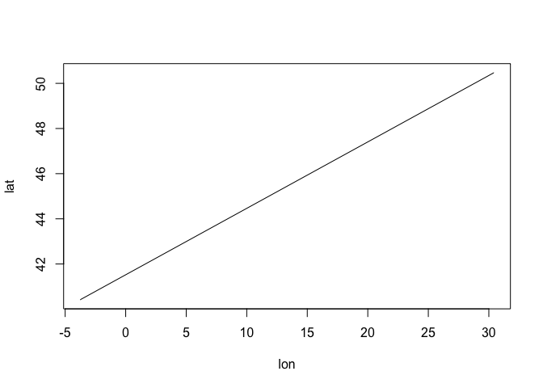

<!-- README.md is generated from README.Rmd. Please edit that file -->

# foofactors

<!-- badges: start -->
<!-- badges: end -->

This package is made as final project for Spatial data with R. It has
function “storetrack3” which creates object of a class “mytrack” and is
used to store name, timestamps, CRS and coordinates of a track. In
addition to this, object of a class “myclass” have print, plot and
summary methods and one additional method for calculating distance of
the track called “distance2”.

## Installation

You can install this package with:

``` r
install.packages("foofactors")
```

## Example

This example shows how to create object of a type “mytrack”. We have
coordinates of two cities, Madrid and Kyiv:

``` r
library(foofactors)
test_object <- storetracks3("Madrid-Kyiv", c("2009-12-25 18:39:21 CST",
                                              "2009-12-25 18:39:31 CST"),
                              4326,
                              data.frame(lon=c(-3.761989,30.415929),lat=c(40.415190,50.470800))
  )
```

In the above example, 4326 is code for WGS84 Geoid. Another code can be
used as well. We can calculate distance with or without using S2. To use
S2 we type:

``` r
distance2(test_object,TRUE)
#> Distance of this route is
#> 2859594 [m]
```

Or for distance without S2 we type:

``` r
distance2(test_object,FALSE)
#> Distance of this route is
#> Linking to GEOS 3.8.1, GDAL 3.1.4, PROJ 6.3.1
#> 2866200 [m]
```

Package also uses few of the methods generate from existing generic
functions, for example plot, print and summary.

### “print” method prints information about what is stored in the object’s slots

``` r
print(test_object)
#> Name of this object is Madrid-Kyiv 
#> Timestamps are  2009-12-25 18:39:21 CST 2009-12-25 18:39:31 CST 
#> CRS used is  4326 
#>         lon      lat
#> 1 -3.761989 40.41519
#> 2 30.415929 50.47080
```

### “summary” method will summarize how many points we have stored in our object

``` r
summary(test_object)
#> Object has  2  coordinates.
```

### “plot” method plots line graph, with the line connecting subsequent points.

``` r
plot(test_object)
```


